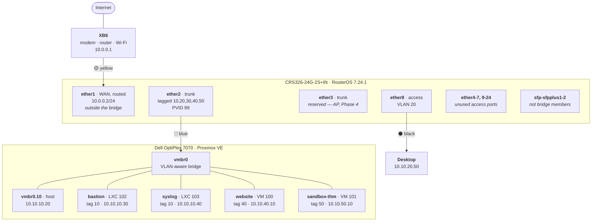
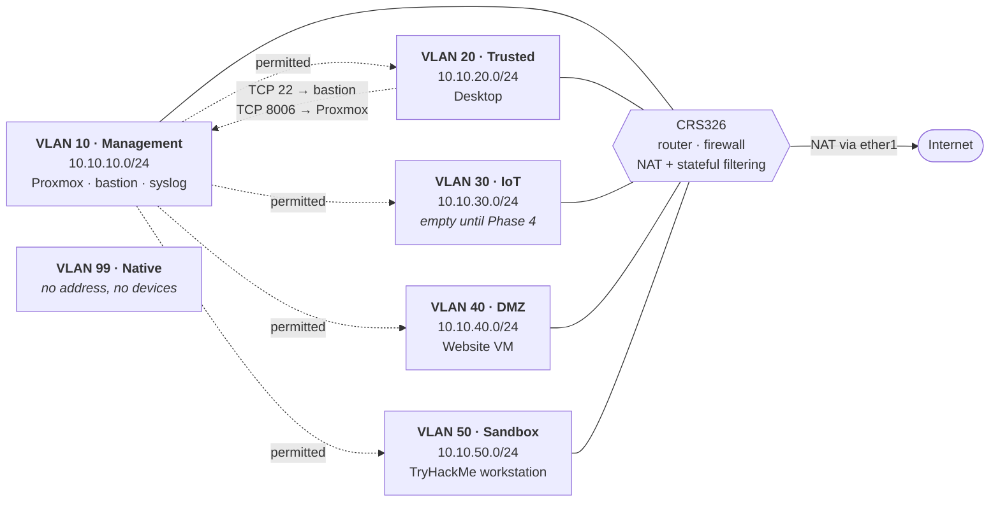

# Network Diagrams

Two views of the same network. **Each hides what the other shows:** the physical view draws one cable to the Dell, while the logical view draws four isolated segments behind it — both are true, and neither diagram can express the other's fact.

Kept as Mermaid so they render on GitHub and still diff as text in git.

**⚠️ Rebuilt 2026-09-11 from observed state**, not from memory — `/interface print`, `/interface bridge port print`, `/interface bridge vlan print`, `/ip address print`, `/ip arp print`, and the Proxmox guest configs. Findings from that audit are in [audits.md](audits.md).

---

## Physical — what is plugged into what

**Note the single blue cable to the Dell.** It carries the host on VLAN 10, two containers on VLAN 10, the website on VLAN 40 and the sandbox on VLAN 50 — **four segments that cannot reach each other, over one wire.** That fact is invisible here and is the entire reason for the second diagram.

### Cable map

| Colour | From | To | Purpose |
|---|---|---|---|
| 🟡 Yellow | XB6 LAN | switch **ether1** | WAN uplink — the only cable touching the public internet |
| 🔵 Blue | Dell `nic0` | switch **ether2** | Trunk — tagged 10/20/30/40/50 |
| ⚫ Black | Desktop | switch **ether8** | Access — VLAN 20 |

**Both ends of every run are labelled** with the same text, including the port number. A label on one end is useless when you are holding the other.

**Three cables. That is the entire physical network.**

### Port map — all 26 interfaces

| Port(s) | Role | VLAN | Frame types | State | Connected to |
|---|---|---|---|---|---|
| **ether1** | **Routed** — outside the bridge | — | — | **Up · 1G full** | XB6 |
| **ether2** | **Trunk** | tagged 10,20,30,40,50 · PVID 99 | tagged only | **Up · 1G full** | Dell `nic0` |
| ether3 | Trunk | PVID 99 | tagged only | Enabled, no link | *reserved — AP, Phase 4* |
| ether4–7 | Access | **10 · Management** | untagged | ⚠️ **Enabled, unused** | — |
| **ether8** | Access | **20 · Trusted** | untagged | **Up · 1G full** | Desktop |
| ether9–11 | Access | 20 · Trusted | untagged | ⚠️ **Enabled, unused** | — |
| ether12–15 | Access | 30 · IoT | untagged | ⚠️ **Enabled, unused** | — |
| ether16–19 | Access | 40 · DMZ | untagged | ⚠️ **Enabled, unused** | — |
| ether20–24 | Access | 99 · Native | untagged | ✅ Disabled | — |
| sfp-sfpplus1–2 | **Not bridge members** | — | — | No link | *Phase 4 backbone* |

**⚠️ The rows marked "Enabled, unused" are audit finding 1** — see [audits.md](audits.md). Fifteen live untagged access ports, four of which land in the Management VLAN.

**`ether1` is deliberately not a bridge port.** It holds `10.0.0.2/24` directly, which is what makes it a routed WAN interface rather than a switched one — the RouterOS equivalent of Cisco's `no switchport`.

**All three active links negotiated 1 Gbps full duplex.** No speed or duplex mismatches.

---

## Logical — how traffic moves

**Solid lines are routed adjacency. Dotted lines are what the firewall permits between segments.** Every pair without a dotted line is dropped by the forward chain's default deny.

### Traffic policy

| From ↓ To → | Internet | VLAN 10 | VLAN 20 | VLAN 30 | VLAN 40 | VLAN 50 |
|---|---|---|---|---|---|---|
| **10 Management** | ✅ | — | ✅ | ✅ | ✅ | ✅ |
| **20 Trusted** | ✅ | ⚠️ **two host-scoped rules** | — | ❌ | ❌ | ❌ |
| **30 IoT** | ✅ | ❌ | ❌ | — | ❌ | ❌ |
| **40 DMZ** | ✅ | ❌ | ❌ | ❌ | — | ❌ |
| **50 Sandbox** | ✅ | ❌ | ❌ | ❌ | ❌ | — |

**The two host-scoped rules from Trusted**, both from `10.10.20.50` alone:

| Destination | Port | Purpose |
|---|---|---|
| `10.10.10.30` — bastion | TCP 22 | **The jump host.** Every other SSH destination goes through it |
| `10.10.10.20` — Proxmox | TCP 8006 | The web UI, which is impractical to tunnel |

**Narrowed 2026-09-09.** The previous rule permitted the desktop to reach **any** VLAN 10 host on TCP 22.

**The asymmetry is deliberate and is what a stateful firewall buys.** Management reaches every segment; nothing reaches management unbidden. A DMZ host can *answer* when spoken to — its replies match `established/related` — but it cannot *initiate* toward anything internal.

**VLAN 99 appears in neither routing nor policy**, because the router has no interface in it. It exists solely so the trunk's native VLAN is not VLAN 1, and it holds no devices — leaving a double-tagging attack nowhere to launch from.

### Management plane

Separate from the data plane above, and easy to overlook when reading the matrix:

| Path | Route | Why |
|---|---|---|
| Desktop → **switch** (TCP 22, 8291) | **Direct**, `input` chain | **Recovery path.** Must not depend on a container running on a hypervisor behind the switch |
| Desktop → **anything on 22** | **Via bastion** | Authenticated, logged, single chokepoint |
| Bastion / Proxmox → switch | `input`, scoped by the `mgmt-hosts` address list | |
| **MAC-connect** (Layer 2) | Scoped to `vlan10` and `vlan20` | Layer 2 fallback that survives a broken IP configuration. **The WAN, DMZ and sandbox paths are closed** |

---

## Verified, not assumed

Every cell above was tested rather than inferred:

| Test | Result |
|---|---|
| DMZ → Proxmox host, DMZ → Desktop | **Dropped** — 100% loss, forward drop counter incremented |
| Management → DMZ | **Permitted** |
| Trusted → DMZ | **Dropped** |
| Trusted → Management, TCP 8006 | **Permitted** — scoped to one address |
| WAN → switch management | **Dropped** — confirmed from off-network |
| Sandbox → Proxmox host, Sandbox → Desktop | **Dropped** — timeout, not ICMP unreachable |
| Sandbox → internet and DNS | **Permitted** |
| Management → Sandbox | **Permitted** — the asymmetry confirmed from both ends |
| Desktop → syslog collector (`10.10.10.40`) | **Dropped** — confirmed 2026-09-10 by the narrowed rule blocking a host built minutes earlier |

---

## Measured throughput — the CPU ceiling

The CRS326 is a **switch with a router attached**. Same-VLAN traffic is handled by the Marvell switch chip at line rate; **inter-VLAN routing, NAT, and firewalling run on the CPU.**

Measured with `iperf3` between the desktop (VLAN 20, ether8) and the Proxmox host (VLAN 10, ether2) — each link crossed once, so no hairpin distortion.

| Traffic | Throughput | Switch CPU |
|---|---|---|
| **Same VLAN** | Line rate | Untouched — hardware offloaded |
| **Cross-VLAN, single flow** | **251 Mbps** | 99% on one core, 43% on the other |
| **Cross-VLAN, 4 parallel flows** | **468 Mbps** | 100% and 69% |

**The single-flow ceiling is a per-core limit, not a device limit.** RouterOS does not spread one connection's routing work across cores, so a single transfer saturates one core while the other idles. Four parallel streams reached 1.86× the single-flow figure by engaging both.

**This is the same behaviour as link aggregation** — one flow is pinned to one path, and only many concurrent flows use the available capacity. The resource differs; the principle does not.

### ⚠️ Consequence for the Phase 4 NAS

A large file copy is **a single TCP flow**, so it gets the **251 Mbps** figure — parallelism does not help it. Across a 10G SFP+ link that is roughly **2.5% of the link**.

**The NAS and its primary consumer must share a VLAN**, so their traffic is switched by the Marvell chip rather than routed through the CPU. This is an architectural decision made at design time, not a setting that can be tuned afterwards.

If cross-VLAN storage access is ever genuinely required at speed, that is the point at which routing moves off the switch — the OPNsense-on-Dell option deliberately left open in the README.
