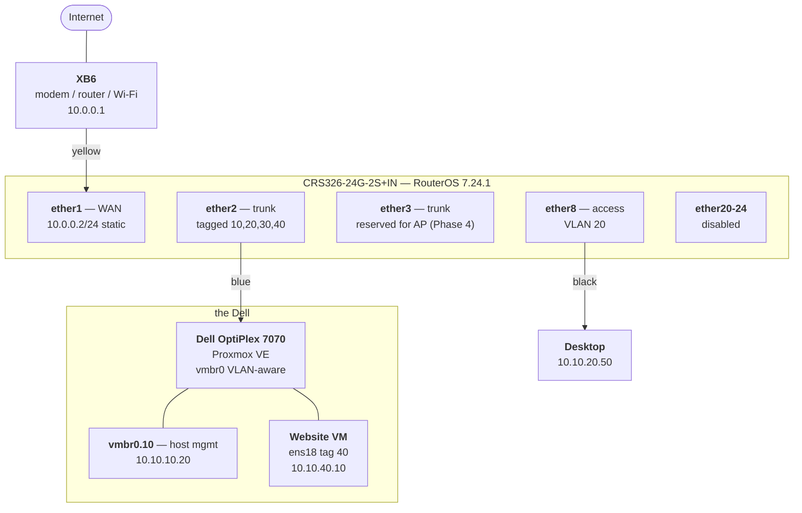
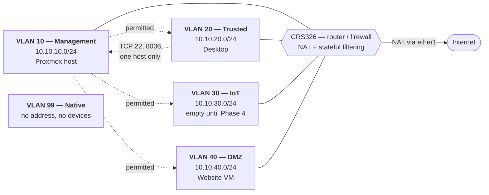

# Network Diagrams — Phase 1

Two views of the same network. **Each hides what the other shows:** the physical view draws one cable to the Dell, while the logical view draws two isolated segments — both are true, and neither diagram can express the other's fact.

Kept as Mermaid so they render on GitHub and still diff as text in git.

---

## Physical — what is plugged into what

**Note the single blue cable to the Dell.** It carries the host on VLAN 10 and the website VM on VLAN 40 — two segments that cannot reach each other, over one wire. That fact is invisible here and is the whole point of the second diagram.

### Cable map

| Colour | From | To | Purpose |
|---|---|---|---|
| 🟡 Yellow | XB6 LAN | switch **ether1** | WAN uplink — the only cable touching the public internet |
| 🔵 Blue | Dell `nic0` | switch **ether2** | Trunk — tagged 10/20/30/40 |
| ⚫ Black | Desktop | switch **ether8** | Access — VLAN 20 |

**Both ends of every run are labelled** with the same text, including the port number. A label on one end is useless when you are holding the other.

---

## Logical — how traffic moves

**Solid lines are routed adjacency. Dotted lines are what the firewall permits between segments.** Every pair without a dotted line is dropped by the forward chain's default deny.

### Traffic policy

| From ↓ To → | Internet | VLAN 10 | VLAN 20 | VLAN 30 | VLAN 40 |
|---|---|---|---|---|---|
| **10 Management** | ✅ | — | ✅ | ✅ | ✅ |
| **20 Trusted** | ✅ | ⚠️ one host, TCP 22/8006 | — | ❌ | ❌ |
| **30 IoT** | ✅ | ❌ | ❌ | — | ❌ |
| **40 DMZ** | ✅ | ❌ | ❌ | ❌ | — |

**The asymmetry is deliberate and is what a stateful firewall buys.** Management reaches every segment; nothing reaches management unbidden. A DMZ host can *answer* when spoken to — its replies match `established/related` — but it cannot *initiate* toward anything internal.

**VLAN 99 appears in neither routing nor policy**, because the router has no interface in it. It exists solely so the trunk's native VLAN is not VLAN 1, and it holds no devices — leaving a double-tagging attack nowhere to launch from.

---

## Verified, not assumed

Every cell above was tested rather than inferred:

| Test | Result |
|---|---|
| DMZ → Proxmox host, DMZ → Desktop | **Dropped** — 100% loss, forward drop counter incremented |
| Management → DMZ | **Permitted** |
| Trusted → DMZ | **Dropped** |
| Trusted → Management, TCP 8006 | **Permitted** — scoped to one address |
| WAN → switch management | **Dropped** — confirmed from off-network |

---

## Measured throughput — the CPU ceiling

The CRS326 is a **switch with a router attached**. Same-VLAN traffic is handled by the Marvell switch chip at line rate; **inter-VLAN routing, NAT, and firewalling run on the CPU.**

Measured with `iperf3` between the desktop (VLAN 20, ether8) and the Proxmox host (VLAN 10, ether2) — each link crossed once, so no hairpin distortion.

| Traffic | Throughput | Switch CPU |
|---|---|---|
| **Same VLAN** | Line rate | Untouched — hardware offloaded |
| **Cross-VLAN, single flow** | **251 Mbps** | 99% on one core, 43% on the other |
| **Cross-VLAN, 4 parallel flows** | **468 Mbps** | 100% and 69% |

**The single-flow ceiling is a per-core limit, not a device limit.** RouterOS does not spread one connection's routing work across cores, so a single transfer saturates one core while the other idles. Four parallel streams reached 1.86× the single-flow figure by engaging both.

**This is the same behaviour as link aggregation** — one flow is pinned to one path, and only many concurrent flows use the available capacity. The resource differs; the principle does not.

### ⚠️ Consequence for the Phase 4 NAS

A large file copy is **a single TCP flow**, so it gets the **251 Mbps** figure — parallelism does not help it. Across a 10G SFP+ link that is roughly **2.5% of the link**.

**The NAS and its primary consumer must share a VLAN**, so their traffic is switched by the Marvell chip rather than routed through the CPU. This is an architectural decision made at design time, not a setting that can be tuned afterwards.

If cross-VLAN storage access is ever genuinely required at speed, that is the point at which routing moves off the switch — the OPNsense-on-Dell option deliberately left open in the README.
